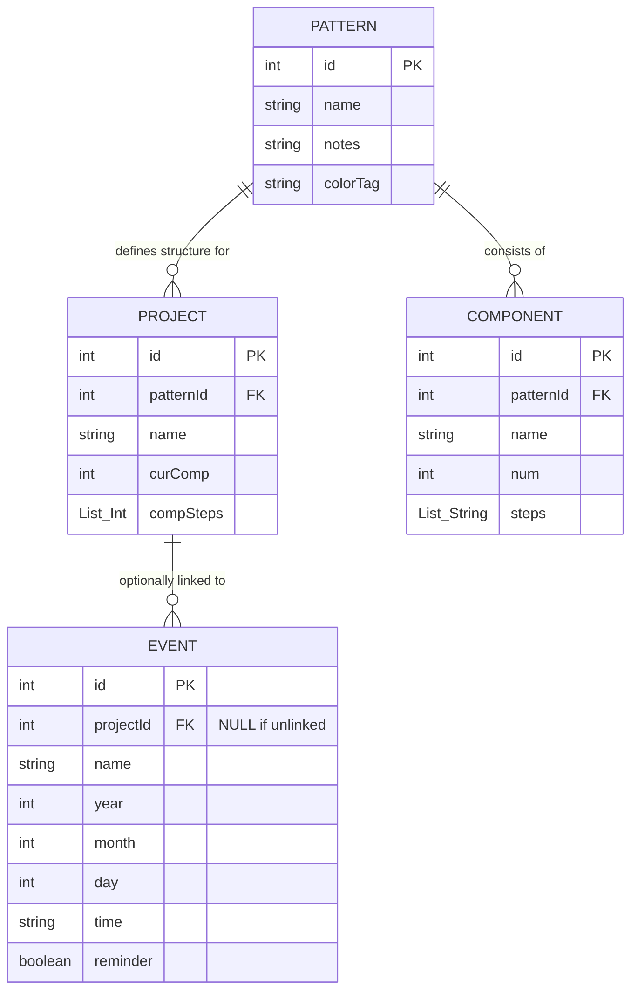

# Crochet Calendar App

An Android application designed to help crochet enthusiasts manage their projects, patterns, and schedule within a specialized calendar interface.

## Database Schema & Relationships

The app uses **Room Database** for persistent storage. Below is a diagram illustrating the relationships between the core data entities:

### Key Relationships:
*   **Patterns & Components**: A `Pattern` acts as a blueprint. It contains multiple `Components` (e.g., "Sleeve", "Body"), each defining specific steps.
*   **Patterns & Projects**: When you start a new `Project`, you link it to a `Pattern`. The project tracks your progress (`curComp`, `compSteps`) based on that pattern's structure.
*   **Projects & Events**: `Events` on the calendar can be optionally linked to a specific `Project`, allowing you to schedule "Crochet Sessions" or deadlines.

---

## Project Structure

The project follows a standard Android Kotlin structure with a focus on **Jetpack Compose** for the UI and **MVVM** (Model-View-ViewModel) architecture.

### 1. Data Layer (`com.crochet.calendar.data`)
*   **`Pattern.kt`**: Contains the Room entity definitions for `Pattern`, `Project`, `Component`, and `Event`. It also includes the `Converters` for handling list-to-string serialization.
*   **`Database.kt`**: Defines the `CalendarDatabase` and the DAOs (Data Access Objects) used to interact with the SQLite database.

### 2. UI & Logic Layer (`com.crochet.calendar`)
*   **`MainActivity.kt`**: The entry point of the app. It houses the `MainViewModel` (which manages the app state) and the `AppRoot` navigation setup.
*   **`CalendarLogic.kt`**: Contains the business logic for date calculations, month/year navigation, and specialized holiday logic (including "moveable" holidays like Easter).
*   **`displays/`**: This directory contains specialized Jetpack Compose screens:
    *   **`CalendarDisplay.kt`**: The main calendar grid and event dialogs.
    *   **`ProjectsScreen.kt`**: View and manage active crochet projects.
    *   **`PatternsScreen.kt`**: Create and edit pattern blueprints and their components.

### 3. Services (`com.crochet.calendar`)
*   **`notifications.kt`**: Handles the `AlarmManager` logic for scheduling event reminders, birthdays, and holiday notifications.
*   **`Prefs.kt`**: Manages lightweight persistence (like custom holidays and birthdays) using `SharedPreferences`.

### 4. Styling (`com.crochet.calendar.ui`)
*   Custom UI components such as `DashedDivider`, specialized shapes, and the `AppColors` theme are defined here to ensure a consistent, "crafty" aesthetic across the app.
